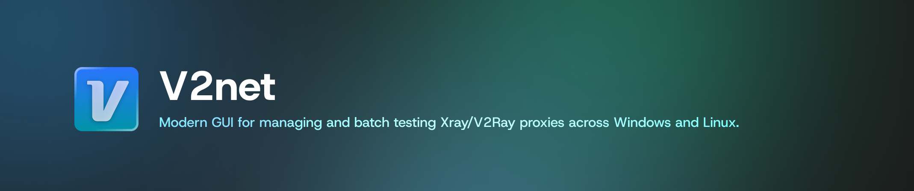
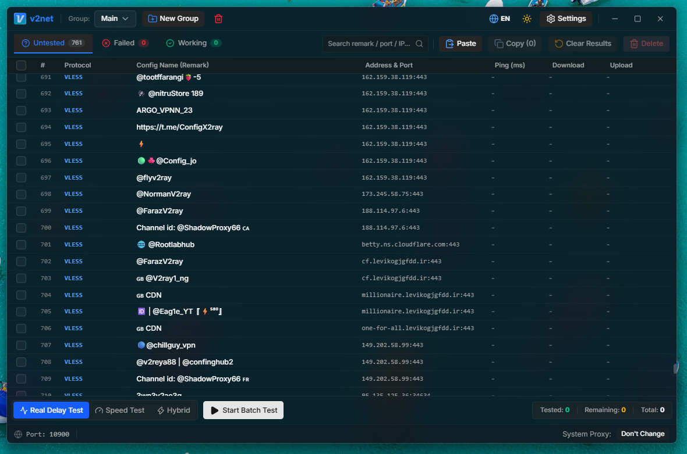

<div align="center">
  <!-- Place your banner image at public/banner.png -->
  
</div>

# v2net

v2net is a high-performance cross-platform GUI application built with **Tauri v2**, **React**, and **TypeScript** designed to batch test, manage, and connect to V2Ray/Xray proxy configurations.

<div align="center">
  <!-- Place your screenshot image at public/screenshot.png -->
  
</div>

## ✨ Features

- **Batch Testing:** Test hundreds of configs simultaneously using a multi-threaded parallel engine.
- **Config Management:** Group your configs logically, rename them, delete them, and keep them organized.
- **Advanced Xray Support:** Supports vless, vmess, trojan, shadowsocks, and more (with reality, tls, ws, grpc, etc.).
- **System Proxy Integration:** Seamlessly set the proxy system-wide on Windows directly from the app.
- **Multi-Stage Testing:** Perform robust multiple connectivity stages to filter out false positives.
- **Modern UI/UX:** A stunning, responsive user interface featuring glassmorphism (Acrylic) and Dark/Light themes built with Shadcn UI and TailwindCSS.
- **I18n:** Full support for Persian (RTL) and English.

## 🚀 How It Works

1. **Import:** Copy your configs from anywhere and paste them into the app (or press `Ctrl+V`). The app automatically parses all supported protocols.
2. **Organize:** Create groups (e.g. "Germany Servers") to manage different pools of configs.
3. **Test:** Click "Start Batch Test". The app generates a temporary `config.json` for chunks of configs, launches lightweight native `xray-core` instances in the background, and tests their real ping and download/upload speeds.
4. **Connect:** Double-click on any working config to connect. The app spawns a dedicated Xray proxy on a local port (e.g., 10900) and optionally routes your system's traffic through it automatically.

## 🛠️ Build Instructions

### 1. Prerequisites

You must install the standard Tauri prerequisites for your OS (Node.js, Rust, and OS-specific build tools).
- See the [Tauri Prerequisites Guide](https://v2.tauri.app/start/prerequisites/).

### 2. Setup the Xray Binary (Important)

v2net relies on the native `xray` core binary to function. Since the binary files are large, they are ignored in git. **You must download the Xray binary manually before building.**

1. Create a `bin` folder inside the `src-tauri` directory if it doesn't exist: `src-tauri/bin/`.
2. Download the latest `xray-core` release for your target OS from the [XTLS/Xray-core GitHub Releases](https://github.com/XTLS/Xray-core/releases).
3. Extract the executable and rename it exactly to match the Tauri sidecar target triple format. For example:
   - **Windows:** Place the `xray.exe` as `src-tauri/bin/xray-x86_64-pc-windows-msvc.exe`
   - **Linux:** Place the `xray` binary as `src-tauri/bin/xray-x86_64-unknown-linux-gnu`
   - **macOS (Intel):** Place the `xray` binary as `src-tauri/bin/xray-x86_64-apple-darwin`
   - **macOS (Apple Silicon):** Place the `xray` binary as `src-tauri/bin/xray-aarch64-apple-darwin`

*Tip: If you're using GitHub Actions for CI/CD, the `.github/workflows/release.yml` file is already configured to do this automatically.*

### 3. Install Dependencies & Build

```bash
# 1. Install frontend dependencies
npm install

# 2. Run in development mode (optional)
npm run tauri dev

# 3. Build the final application (.exe / .deb / .appimage / .dmg)
npm run tauri build
```

Your compiled application and installers will be available inside `src-tauri/target/release/bundle/`.

## 📝 License

This project is open-source. Please see the `LICENSE` file for details.
